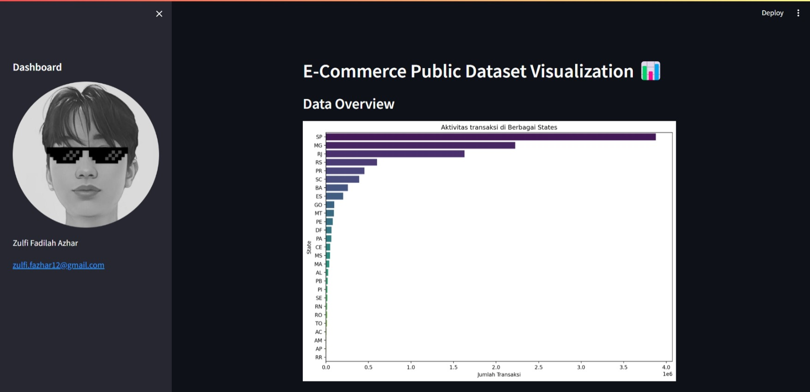

# Dicoding Proyek Analisis Data: E-Commerce Public Dataset

## Bio
- Nama    : Zulfi Fadilah Azhar
- Email   : zulfi.fazhar12@gmail.com
- Dashboard Preview :


# Cara menjalankan Dashboard secara local
## Setup environment
Pastikan requirements yang diinstall adalah requirements yang berada pada folder dashboard.
```
conda create --name main-ds python=3.11
conda activate main-ds
pip install -r requirements.txt
```

## Run steamlit app
```
streamlit run dashboard.py
```